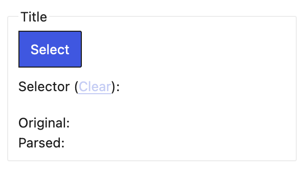

# Site Definitions

> This documentation is not required to effectively use *Try WordPress*. It is intended for users who would like to contribute to the development of the project, or would like to better understand how *Try WordPress* works internally.

Site *Definitions* make it easier for you to import your site by allowing *Try WordPress* to automate parts of the import process. If your existing site is hosted on a *Platform* for which there is a *Definition* (for example, Ghost or Drupal), *Try WordPress* will automatically understand how your site is structured, and will be able to import content in a mostly-automated way.

You are still able to import your site even if there currently is no *Definition* for the platform where your site is hosted. In this case, *Try WordPress* will guide you through creating a custom *Definition*, which is then used throughout the import process. You also have the option of contributing the *Definition* you created so that it's included in future versions of *Try WordPress*, if you think it could be useful to others.
## Source *Platforms*

Before diving into what a *Definition* is, it's important to understand the notion of *Platform*. *Try WordPress* is able to import sites regardless of where they are hosted, or which technology they're built on. Examples of *Platforms* might be:

- Ghost, Jekyll or other static site engines
- Drupal, Joomla, WordPress or other CMSes
- Cloud hosting platforms like Wix or Squarespace
- Generic web servers

*Try WordPress* can import content from a *Platform* in two ways:

1. **Structured import**: When the Platform provides an API, or an export feature that allows you to export your content as a zip file, for example. This type of import is mostly automated and produces the best results. **In this mode, a *Definition* is not needed** because *Try WordPress* will already be able to access the content in a structured form.
2. **Generic import**: When there is no way for *Try WordPress* to obtain the content of the source site in a structured form. In this mode, *Try WordPress* guides you through the process of creating a custom *Definition*, and then uses that *Definition* to extract the content from your site's HTML.
## What is a *Definition*?

A *Definition* is in essence a text file that specifies the structure of the content of your site. The *Definition* for a blog post might look something like the following:

```json
{
    "name": "my-website/blog-post",
    "subject": "blog-post",
    "attributes": {
        "title": {
            "type": "text",
            "path": "//div[@id='title']"
        },
        "date": {
            "type": "date",
            "path": "//div[@id='date']"
        },
        "content": {
            "type": "html",
            "path": "//div[@id='content']"
        }
    }
}
```

> The `path` attributes in the example above are merely examples. In reality, the paths might be more complex, and will vary from website to website.

### Types of attributes

In the example above you can see that each attribute has a `type`. This is necessary for *Try WordPress* to correctly interpret the information. Currently, the following types are available:

- `text`: Plain text, like the title of a Blog Post, or the name of a Product
- `date`: For example, the date a Blog Post was published, or the start time of an Event in a calendar.
- `html`: Any HTML markup.

In the future, as *Try WordPress* develops, there will be other types of attributes.
## Creating a *Definition*

*Try WordPress* provides a UI for creating *Definitions*, so you do not need to manually create the *Definition*'s text file. You select the attributes through the UI and the *Definition*'s file will be created in the background. Here's an example of what the UI for selecting the title of a Blog Post looks like:



> TODO:
> When creating a Definition from scratch, it's not know what attributes should be present, nor the type of those attributes. For this reason, the user needs to be able to add attributes as they please, for example:
> 
> - User click `+` button
> - User sees a list of all the available types of attributes, and clicks on the type of they want to add
> - Only then is the UI of the screenshot above displayed

## Contributing a *Definition*

TODO
UI

## Other ways to contribute

- Another way of contributing would be verifying definitions
- Fixing issues in definitions


----

- A new page for contributing, but not contributing to the code
- Manual of the tool for the user
  - But also manual for how a non-technical user can contribute
- Take all this and write a “mission statement”
- How would contribution work? Avenues of contribution.
## UI

- What would the finished extension look like?
  - Mock screenshots for how a user can contribute
- How would this contribution flow work?
  - Click a button to “share” definition
- A theme on Squarespace
  - Suggest to use a prior definition that was created by a user for the same theme
- At the end of an import
  - “Export” so that other users can take advantage of that work
## FTR

- “Pre-processing” step
  - FTR config as a “strip” step
  - “We need to prepare the source site first”
  - First remove stuff that is “in the way”
